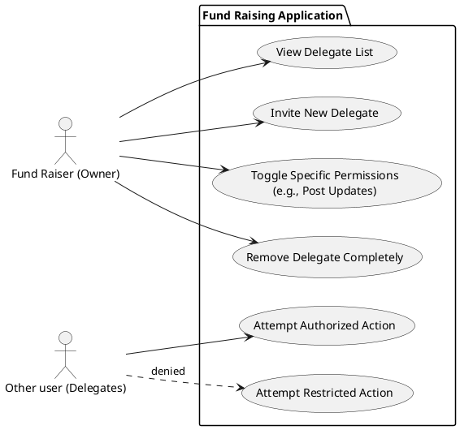

# Campaign access delegation

## User story

As a fundraiser, I want to authorize user accounts (delegates) with limited permissions so that I can delegate tasks like posting updates and responding to inquiries without sharing my account, while preventing them from performing restricted actions such as modifying or closing campaigns.

## Use case description

| **Field**           | **Details**                                                                                                                       |
| :------------------ | :-------------------------------------------------------------------------------------------------------------------------------- |
| **Use Case Name**   | Manage Dynamic Delegate Permissions                                                                                               |
| **Primary Actor**   | Fund Raiser (Campaign Owner)                                                                                                      |
| **Secondary Actor** | Delegate (Assistant) System                                                                                                       |
| **Description**     | Allows a Fund Raiser to assign, modify, or revoke specific functional permissions to a Delegate for a specific campaign resource. |
| **Goal**            | To delegate tasks without sharing credentials or full campaign control.                                                           |

Permission includes:

- Socials
  - CanPostUpdate
  - CanReplyToEnquiry
  - CanPinComment
  - CanDeleteComment
- Detail
  - CanUpdateBanner
  - CanEditDescription

---

### **Pre-conditions**

- **Authentication:** The FR is logged in.
- **Ownership:** The FR is the creator / owner of the campaign resource
- **Delegate:** The person being invited must have a valid email and an existing account

---

### **Normal Flow**

1. **Access management:** The FR selects "Manage Delegates" from their Campaign Dashboard. FR able to view existing delegates and permission granted
2. **Identify delegate:** The FR enters the Delegate's email address.
3. **Fetch permissions:** The system retrieves a list of permissions
4. **Set permission:** The FR checks the boxes for permissions they want to allow.
5. **Save & Commit:** The FR clicks "Save Changes"
6. **Database update:** The system writes entries into the `CampaignDelegatePermission` table, mapping the `UserID`, `CampaignID`, `PermissionString`, `StartDate`, `EndDate`.

---

### **Sub-flows**

- **Update existubg deletgates**
  - The DR unchecks a permission for an existing Delegate
  - The system deletes that specific record from the database
  - The next time the Delegate attempts that action, its actions will be blocked

---

### **Alternative / Exception Flows**

- **Email / User doesn't exists in system**
  - If a email that FR tries add doesn't exist, the UI should show that the user doesn't exists and prevent delegation

### **Post-conditions**

- **Data Integrity:** The `CampaignDelegatePermission` table accurately reflects the current allowed actions.
- **Access Control:** The Delegate is restricted to the specific resource (Campaign ID) and specific actions (Permissions) granted by the owner.
- **Audit Trail:** An entry is logged show what & when the the permissions was updated

## Use case diagram

