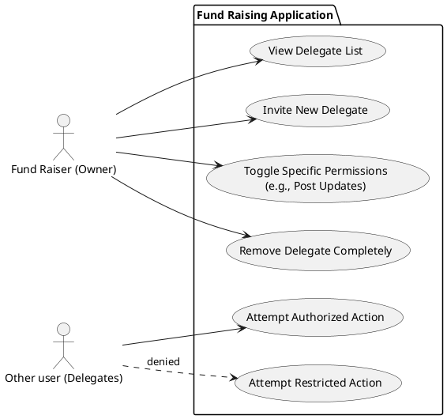

# Campaign access delegation

User story:

As a fundraiser, I want to create or authorize additional user accounts (delegates) with limited permissions so that I can delegate tasks like posting updates and responding to inquiries without sharing my account, while preventing them from performing restricted actions such as modifying or closing campaigns.

