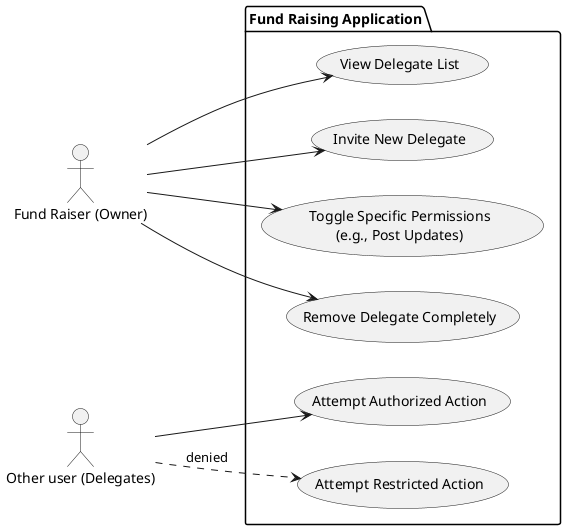

# Campaign access delegation

## User story

As a fundraiser, I want to create or authorize additional user accounts (delegates) with limited permissions so that I can delegate tasks like posting updates and responding to inquiries without sharing my account, while preventing them from performing restricted actions such as modifying or closing campaigns.

## Use case description

| **Field**           | **Details**                                                                                                                       |
| :------------------ | :-------------------------------------------------------------------------------------------------------------------------------- |
| **Use Case Name**   | Manage Dynamic Delegate Permissions                                                                                               |
| **Primary Actor**   | Fund Raiser (Campaign Owner)                                                                                                      |
| **Secondary Actor** | Delegate (Assistant) System                                                                                                       |
| **Description**     | Allows a Fund Raiser to assign, modify, or revoke specific functional permissions to a Delegate for a specific campaign resource. |
| **Goal**            | To delegate tasks without sharing credentials or full campaign control.                                                           |

Permission includes:

- Socials
  - CanPostUpdate
  - CanReplyToEnquiry
  - CanPinComment
  - CanDeleteComment
- Detail
  - CanUpdateBanner
  - CanEditDescription

## Use case diagram

